# Advance Famicom Wars

<p align="center">
  
</p>

This repo contains a patch which overhauls Famicom Wars by applying several features from its predecessor, Advance Wars. This includes:
- Adding [first strike](https://github.com/schil227/FamicomWarsFirstStrike)
- Changing the damage which units deal
- Adjusting costs
- Tweaking movement
- Swapping the "Fighter B" unit for a Battle Copter

In short: it's Famicom Wars, but actually fun.

Note that this patch supports the (currently) newest english translation, however it requires an extra patch step. 

## **Installation**  <a id="installation"></a>

To install the patch, follow these steps:
* Have a copy of the Famicom Wars .NES file (*These steps will override the existing file, so make sure to copy the original if you wish to have a vanilla version of the ROM*)
* Download the patch `Advance_Famicom_Wars.ips` from this repository
* Download [Lunar IPS](https://www.romhacking.net/utilities/240/), a program which can be used to apply the patch
* Run Lunar IPS
    * Select "Apply IPS Patch"
    * Locate the Advance_Famicom_Wars.ips file
    * Next, Locate the vanilla Famicom Wars .NES file (again, I suggest making a copy beforehand)

At this point the rom can be played - but if you would prefer to play with an english translation, there are some additional steps:

* Download the Famicom Wars English patch (released by Stardust Crusaders) [here](https://www.romhacking.net/translations/6828/), extract the compressed directory
* Using Lunar IPS, follow the above steps, but instead apply the translation IPS patch `NES Wars.ips` *to the previously patched .NES file*
* Next, download the other patch from this repository `Advance_Famicom_Wars_Post_Eng_Patch.ips`
* Again, use Lunar IPS to patch the "Post Eng Patch" to *the same .NES file*

Then, you're done. Here's an image to help illustrate the steps:

<p align="center">
  
</p>

## Why This Patch Was Created
Shortly after rolling out the First Strike patch, I (tried) to play a bit of Famicom Wars - but the gameplay is still not right. The more you look at it, the more you see just how wildly unbalanced everything is. For example, I extracted the damage which all the units do to one another into a table:

### The Damage
<p align="center">
  
  </br><i>Here it is. Note: the heat-map is just for "bigger numbers", nothing special.</i>
</p>

There are some things one could extract from this, but one of the biggest is that, pound-for-pound the infantry is far and away the best unit. For one, they can attack everything, from battleships to bombers. In vanilla Famicom Wars, a bomber (worth 20000G) can attack an infantry (1000G), and do a *pathetic* 55% damage (that's 550G). Meanwhile, since there's no first-strike, the infantry attacks the bomber, and does %5 damage... which is 1000G.

<p align="center">
  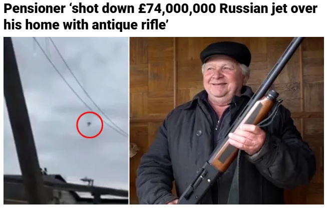
  </br>
   The rifle is valued at £3,700,000 (<a href="https://metro.co.uk/2022/09/06/ukrainian-pensioner-awarded-medal-after-shooting-down-russian-aircraft-17306308/">link</a>)
</p>

Also, notice that an infantry does 45% damage to other infantry - this means that you would need 3 infantry to destroy one. And in the vanilla version of the game, those attackers would be in rough shape after destroying the one defender. In fact, 45% is the rule for any unit which attacks itself (again, 3 to 1 destruction ratio). But also take note: no one unit outright destroys another. We have a handful of units which do 95% damage, but nothing which KOs a unit in one hit. This is lame. Finally, the utility of all the units is quite lopsided. Some units (infantry, fighters, battleships, etc.) can strike everything, and are inherently more valuable. Why does Tank B do the same (more?!?) damage than Tank A? Why does an anti-air only shoot wet spaghetti noodles at airplanes? Why are battleships unsinkable? Why, why, why.

Some of these things are almost justified by the money.

### The Cost

I have another chart for you:

<p align="center">
  
  </br><i>Here it is.</i>
</p>

There are some dubious values here, to be sure: unsinkable Battleships cost 28800G, unsinkable Mechs are 2000G, Landers are an eye-watering 18500G. But what is the true value of these units? A Battleship is crazy expensive, but it is a virtually unsinkable juggernaut, so that kinda makes sense. But the lander, a unit whose main purpose is to shuttle land units, gets a crappy machine gun strapped to it's deck. Added functionality costs something, but it's main purpose is to be a "cheap" way to deal with battleships.

But, wholistically, the Wars series (or, perhaps "wars" in general) are strongly tied to economics. In a game setting, these economics need to balance out. Take this example:

In Advance Wars, the bomber is a top-tier unit; it can move quickly and it annihilates ground units, so it's going to cost a lot (22000G) - however it is quite flimsy, and can be destroyed by certain units rather quickly, especially the fighter and anti-air. So naturally, you want to protect your bomber, and depending on how much the opponent spends (either a significant sum for a fighter (20000G), or they go for the economical AA (8000G)) the effects will be proportional. An AA keeps a zone of control on the land, while a fighter, with its whopping 9 movement, can out-zone your bomber for most of the map. With your bomber, you need to move carefully; if it's an AA, you can try to punch through with your other units to damage the AA, or get the first strike and blow it up yourself. If the threat is a fighter, you need to strike in tandem with other units to protect you bomber with mutually assured destruction (e.g. a missile unit covering your bomber, an AA waiting in the wings, etc.). And of course, you would only make a calculated risk to, say, attack a rocket which has your medium tank pinned down - but you wouldn't if it meant a net-loss of sacrificing your bomber. 

That is all to show, the cost of the units themselves have an integral part of the strategy of Advance Wars. Further, units have natural counters; medium tanks against the indirects, rockets against anything this side of the mountain range, battleships against subs, etc. These natural counters come at a cost, either monetary or in function. 

But, in Famicom Wars, it would take 7 shots from an Artillery (A or B) to sink a battleship. It would take 4 attacks from a Lander. *It would take 3 bomber strikes*. The economics just don't add up. And granted, this is more of an issue with the battleship not having a natural counter, such as a submarine, however the units to dislodge it cost big, big money and do a terrible job at it. This can also be applied to infantry, but on the inverse: they cost nearly nothing, and the things which are good at destroying them are expensive, and thus loose the attack trade. 

So does the cost justify the value? Not really.

Economics are one thing, but what about mobilization?

### The Movement

I have at least one more chart for you:

<p align="center">
  
  </br><i>Here it is.</i>
</p>

The trend for this is largely that the more expensive units tend to have better movement. Tank A has 6, while Tank B has 5. Battleships move 6, and Landers move 5. This concept was inverted with Advance Wars, where the usually inexpensive units had generally better movement, so you had to be more strategic with your units.

Take the NeoTank (22000G): what makes it such a big threat? Unlike a bomber it is heavily armored, and does not suffer from getting countered by cheap direct units (e.g. an anti-air). However at the same time, it is stuck on the ground, suffering the terrain costs. It hits harder than the medium tank, and is designed to be a counter to them; but just as well you could use another medium tank and spend the extra 6000G on an artillery. Indeed: the real value that the NeoTank brings is its +1 movement. Coupled with the "tread" movement type, it has the best maneuverability possible for a land-based unit (only outpaced by the wily recon on ideal terrain). Restated, the NeoTank fixes the main vulnerability of the medium tank: it's movement.

This tangent is largely to point out that movement is integral to the value of a unit, and how it can be used to balance out the gameplay. If cheaper, weaker units are also easier to hit because they cannot move very far, then their viability drops off as the more expensive units are outright better. Advance Wars grew into that balance, but it took a few iterations for Famicom Wars.

But otherwise, generally the movement values are a little off. Speaking of a little off...

### The "Triangle"

Now, compared to Advance Wars, Famicom Wars is just a different game. It plays different, the strategy is different, the "meta" is different. But between the damage output, the cost, and the movement, there's a noticeable lack of synergy in the gameplay. No first strike means movement matters a lot less, or rather, it only serves to *avoid* combat. Direct units are inherently less valuable than indirects, as they always lose a hp whenever you use them. The general concept of "strategy" in Famicom Wars boils down to using indirects and infantry walls, and the game devolves into a slog.

By contrast, the units of Advance Wars are very efficient at what they do. Infantry still play a critical role, however they are made much more fragile and much less effective: they capture, counter other infantry/mechs, and protect your army (and notably, they do not shoot down bombers). Tanks probably compose the next biggest chunk of your army, which are economically valuable units to destroy indirects, and protect your "squishy" units. The natural counter to Tanks are battle copters, which are able to strike with superior maneuverability, but are torn to shreds by the anti-air. Anti-air are excellent at removing infantry walls, and better at KO-ing expensive air units, but are weak to the tank. What I just described is known as the Triangle; tank beats AA, AA beats BCopter, and BCopter beats tank. But that's a simplification - you also have the threat of indirects, the power of "tech-ing up" to medium tanks, etc. - the point is, there is a lot of nuance to the strategy of Advance Wars.

This is, of course, not to put down Famicom Wars. Without Famicom Wars there is no Advance Wars, and Advance Wars had the massive benefit of learning what does and doesn't work from the previous installments. But it does beg the question: knowing what we know now, how could we change Famicom Wars to adopt the advances of Advance Wars?

## The Changes
The goal of this patch was to balance things out. The easiest way to do this is to apply the Advance Wars formula bit-for-bit to Famicom wars, but that's not quite possible. See, there are a few differences (many technical) that would need to be resolved, but in doing so it would dilute the game. We already have Advance Wars, we don't need a carbon clone, we need Famicom Wars to be fun. 

That said, before getting into the changes, we should go over what wasn't changed.

### What Wasn't Changed
<p align="center">
  
</p>

- Mech units require 2 movement to cross mountains (as opposed to 1)
  - This is due to them sharing a movement type with infantry. Later games have a separate "mech" movement type giving them 1 movement on everything, here it was left as is.
- Units are not automatically supplied
  - Famicom Wars requires an extra step of calling the "supply" command before units get healing/fuel/ammo. It doesn't effect units which were already used, so the only real benefit is for picking units which you explicitly *don't* want to supply, and for punishing forgetful players.
- APC/Landers: loading units ends the transport's turn
- Battleships have a smaller range (3-5 spaces)
- (Spoilers) the new Battle Copter unit is still referred to as Fighter A
- Supply units cannot resupply air units
- The CPU Player
  - As in, they're the same bone-headed ding-dongs they were before. I offer no guarantee on their quality post-changes, but I played a match and seemed as competent as before

As for the reason *why* these things weren't changed, it ranges from indifference, to (I'm) technically incapable, to "It's just fine the way it is" (cope).

### Updated Damage

<p align="center">
  
</p>

This table is largely lifted from Advance Wars; units do what you expect them to. Medium tanks hit like a truck, bombers hit like a medium tank, and anti air was upgraded from "noodle shooter" to "war criminal". The ill-fitting Fighter B unit was changed to a battle copter, and mirrors its damage. Transports can no longer attack, but battleships are significantly more susceptible to air units.

Everything fits into place, except for the APC. In Famicom Wars, the APC is a weird mix of the Advance Wars APC (can transport troops) and recon (can shoot) units. It uses the "tread" movement type and can move 6 spaces, and it notably cannot supply units. So the question becomes: what the hell do we do with this? After some thought, I decided that the damage that it does should match that of the recon, while the damage that units do to it should be like the Advance Wars APC (meaning, in Advance Wars, units tend to do more damage to Recons than the more well-armored APCs). With this little artistic touch, we keep the Famicom Wars "weirdness" with a neat little unit.

### Updated Cost

<p align="center">
  
</p>

Of course, in order for the economics to make sense, costs need to be updated. In general, the low-tier units have become more expensive to match their increase in firepower, the greatest jump happening to the anti-air unit (5500G -> 8000G). For the APC, I considered the swap of "supplying" with "having a machine gun" enough to warrant the 5000G price, while the Supply unit sticks with a reasonable 3000G. 

### Updated Movement
<p align="center">
  
</p>

Generally speaking, the low-tier units get a boost, while the high-tier units get reduced. Coupled with the first-strike change, these slight changes have a large impact, and make movement a significantly more valuable stat.

### Establishing the "Triangle"

As mentioned, the Fighter B unit was swapped out for a Battle Copter.

<p align="center">
  
  </br><i>The B stands for battle copter :^)</i>
</p>

And with this change, it's like the final piece falling into place to make the game whole and balanced. With a few exceptions, the game more-or-less plays like Advance Wars. The under-10000G-units contribute a lot more to the game, infantry walls are not nearly as impenetrable, you have the triangle, tech-ing up to expensive units, etc. It's not completely identical to Advance Wars; in fact with all the outstanding differences, I would say that it changes about as much as Advance Wars 2 or Dual Strike did from their predecessors.

---

For all the work I put into it, the actual list of changes feels small - but that's the nature of coding. There's a lot that went on behind the scenes, which I'll dive into.

## Technical Details
As always, for your (and mainly my) benefit, I'll outline "how" the changes were made. The First Strike changes were done in a previous patch and outlined in detail [here](https://github.com/schil227/FamicomWarsFirstStrike). Outside of that, it's worth noting that all the changes made for this patch had something to do with changing the properties of units; nothing "structural". Each unit has a unique id, which is often used when looking up unit properties. Here's a handy table mapping the units and their ids:

<p align="center">
  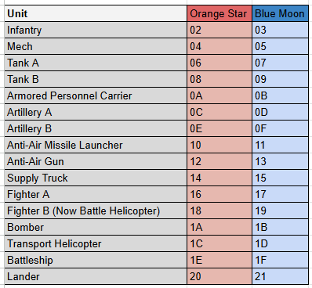
  </br><i>It starts with $02, because it does.</i>
</p>

From what I can tell, the distinction between OS and BM unit ids is largely for graphical purposes. An OS infantry has the same properties as a BM infantry, they just look different. As such, the type of the unit will often be "normalized" - that is, a BM unit id is converted to a OS unit id by applying `AND #FE` - so (for example) `$1D` is turned into `$1C`. Anyway armed with this knowledge, we can look into changing the damage output for each of the units.

### Changing the Damage 
The first step in making the game more tolerable was updating the damage which all the units did. As a part of my research for the First Strike patch, I found that the Damage Table was located at `$E4E2`. I already covered how the table works [here](https://github.com/schil227/FamicomWarsFirstStrike#the-damage-lookup-table), but basically it functions by taking the two unit ids (attacker and defender), combining them into an index and storing it into the `Y` register, and then `$E4E2 + Y` is the hex value for the damage that the attacker does to the defender. There are 16 units, which each do (or, don't do) damage to 16 other units, which means we can take the 256 values starting at `$E4E2`, and create a table from them. These are the values:

```
2D 23 05 0F 19 05 0F 05 0F 19 05 05 05 0F 05 05 
37 2D 19 23 2D 23 2D 2D 2D 5F 0F 19 0F 19 05 05 
55 5F 2D 41 4B 55 5F 55 4B 55 0F 19 0F 19 0F 0F 
37 2D 19 2D 5F 37 4B 55 4B 41 0F 19 0F 19 0F 0F 
55 5F 0F 19 2D 23 23 23 2D 37 0F 19 0F 0F 05 05 
2D 23 37 41 41 2D 37 37 41 41 00 00 00 00 0F 19 
2D 23 2D 37 37 23 2D 2D 41 37 00 00 00 00 0F 19 
00 00 00 00 00 00 00 00 00 00 41 4B 41 4B 00 00 
00 00 00 00 00 00 00 00 00 00 41 4B 41 4B 00 00 
00 00 00 00 00 00 00 00 00 00 00 00 00 00 00 00 
37 37 05 0F 19 0F 19 0F 0F 2D 2D 41 5F 41 05 0F 
2D 2D 05 05 0F 05 0F 0F 0F 23 0F 2D 41 4B 05 05 
37 37 41 4B 4B 41 4B 41 41 4B 00 00 00 00 2D 41 
37 37 05 05 0F 05 05 0F 0F 2D 05 05 05 2D 05 05 
55 55 55 5F 5F 55 55 55 5F 5F 41 4B 41 4B 2D 4B 
0F 0F 19 19 19 19 19 19 19 19 2D 41 37 41 19 2D
```

And, to fancify it up a bit:

<p align="center">
  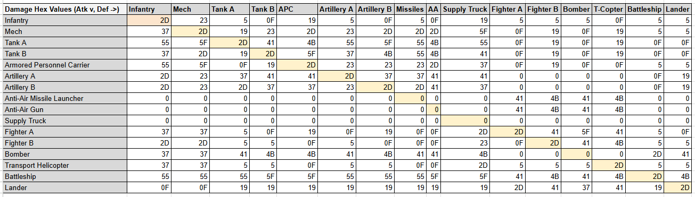
  </br><i>Note: the decimal values are posted in a previous section.</i>
</p>

The solution is very straightforward; just replace these values with new ones. As mentioned, I based my changes off the data from Advance Wars, while only modifying a few things (e.g. APC does Recon damage, receives APC damage). After filling out the table in decimal (posted in a previous section), I used a DEC2HEX macro and converted the values, and ended up with this:

<p align="center">
  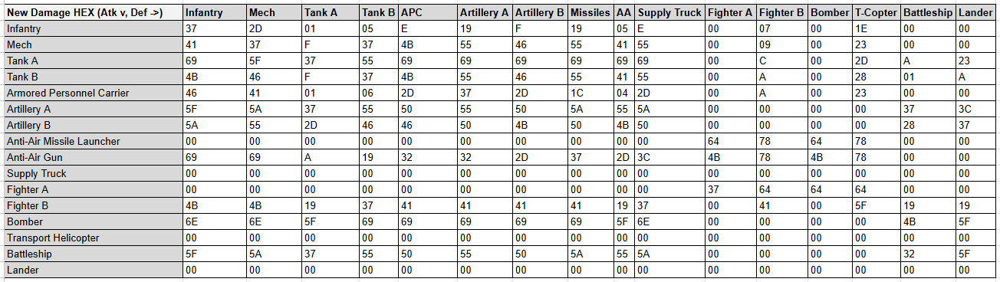
  </br><i>Note: the decimal values are posted in a previous section.</i>
</p>

And so, I simply overwrote that block of code with the new one, and the damage is updated. 

### Changing the Cost

Conceptually, the change for this is easy - somewhere in the code, there is some number (or collection of numbers) which represent how much the unit costs, and all I need to do is change that number. The difficulty comes in figuring out *where* that number is stored, and as it turns out, *how* it's stored.

The investigation step started out pretty basic; looking through the zero-page while moving around the unit menu, and seeing what happens when a unit gets purchased. This lead to setting breakpoints when some values got changed, and after wandering through a lot of code, eventually I came to something interesting: the unit "objects". This code started at `$E226` (with the infantry unit), and contained a bunch of values. I'll stick two of them next to each other:
        `00 01 02 03 04 05 06 07 08 ...`
Inf   : `02 03 01 01 02 0A 00 64 09 01 01 63 00 00 00 00 08 12 17 0F 0A 17 1D 1B 22`
Mech  : `02 02 01 01 02 0A 00 C8 03 03 01 46 00 00 00 00 08 0E 17 10 12 17 0E 0E 1B`
Tank A: `06 06 04 01 03 0A 06 40 06 05 01 46 00 00 00 00 06 1D 0A 17 14 FF 0A 06 05`

Just from these 3 data points, we can start to make some guesses at what this data means if we start thinking about some of the known unit properties. For example, we know that an infantry has 3 movement, mechs have 2 movement, and Tank A (currently) has 6 movement. Infantry and mechs can move on mountains, whereas tanks cannot - they have different movement type. Looking at the the first two values for these objects, we can start to draw a conclusion that the 2nd value is probably the movement for the unit, and the first value *could* be the movement type.

After *more* code analysis and debugging, I concluded that the 5th, 6th, and 7th values have something to do with the cost of the unit... but I couldn't really see how. All the unit objects have `0A` as the 5th value, the 6th value was usually a low number, and greater for the more expensive units (e.g. Tank A is worth 16000G and has a value of `$06`), and the 7th value also seemed kinda proportional. The cost of the units (the greatest being 28800G) is clearly too big to fit in a single byte of data, so it makes sense that the 6th number was the "hi" byte and the 7th was the "lo" byte, and together they would make the total. However when looking at these values, I couldn't make sense of it - because there was some mysterious algorithm that those values were being pumped into, and then *the result* was equal to the cost of the unit. 

Taking a look at my (verbatim) notes, this is the Mysterious Algorithm:

```
 Back to cost: the 5th value of these units is 0A, which is binary for 10. This makes me think that maybe the mystery JSR is a conversion step... multiplying the value by 10, maybe?

[...]

 For Tank B, lo value 58 is in $00 first against $01's 0A:


LDA #00		; Load the number 0 into acc
STA $02		; Store it in $02
LDX #08		; Load 8 into X (smells like number shifting)
LSR $00		; shift right 58 -> 2C (0010 1100)
BCC	03		; Branch if Carry is clear
			    ; In this case, it is, so it jumps ahread
CLC			  ; Clear Carry
ADC $01		; Add #0A to the Accumulator			
ROR			  ; rotate Acc right; Acc is 0, no change, no clear flag
ROR $02		; No change cause clear flag is empty, also 0
DEX			  ; Decrement X => 7
BNE F3		; jump back to LSR

... wtf is this shit doing?
```

(For more context, this sub routine is called twice. The first time, the "lo" cost value is stored in `$00` and `#0A` is stored in `$01`, and then the 2nd time, the "hi" value is stored in `$00`.)

Clearly, I conceptually didn't understand what was going on here. It wasn't until I wrote it alllll out on paper, all 8 iterations of the loop, until I finally understood: it was indeed multiplying the input value by 10. Upon realizing this, I googled it, and sure enough, this is an implementation of the [Shift and Add](https://www.lysator.liu.se/~nisse/misc/6502-mul.html) algorithm. 

The value of the unit is stored at 1/10th its value, so when the player buys a unit, it must multiply that value (bytes 6 and 7 in the object) by `#0A` (ten) to get the true price. This becomes clear if we do some conversions: for infantry, `$0064` is 100, for mechs `$00C8` is 200, Tank A `$0640` is 1,600, etc. Also it makes sense that it would reduce the value like so, as when the unit gets healed it needs to multiply that value by 2 to charge the player for the repair; it would take up unnecessary space and "de-normalize" the data to have two separate values.

Anyways - the fix was now clear: for each unit object that needed a price change, I just needed to change the values, like so:

```
 Price corrections and locations:
 Mech: 200 -> 300
	$E240: $00 -> $01
  $E241: $C8 -> $2C
 
 Tank B: 600 -> 700
	$E275: $02 -> $02
	$E276: $58 -> $BC

 APC: 420 -> 500
	$E289: $A4 -> $F4
 
 Rockets: 1300 -> 1500
	$E2A2: $05 -> $05
	$E2A3: $14 -> $DC
 
 Artillery: 550 -> 600
	$E2BB: $02 -> $02
	$E2BC: $26 -> $58
	
 AA: 550 -> 800
	$E2EE: $02 -> $03
	$E2EF: $26 -> $20
	
 Fighter: 2200 -> 2000
	$E31C: $08 -> $07
	$E31D: $98 -> $D0
	
 BCopter: 1500 -> 900
	$E334: $05 -> $03
	$E335: $DC -> $84
	
 TCopter: 400 -> 500
	$E364: $01 -> $01
	$E365: $90 -> $F4
	
 Bomber: 2000 -> 2200
	$E34C: $07 -> $08
	$E34D: $D0 -> $98
	
 Battleship: 2880 -> 2800
	$E37A: $0B -> $0A
	$E37B: $40 -> $F0
	
 Lander: 1850 -> 1200
	$E38F: $07 -> $04
	$E390: $3A -> $B0
```

And like that, the economy is complete. 

### Changing the Movement

As mentioned in the previous section, the first two values in the unit "object" are indeed the movement data. Here's a reminder:

        `00 01 02 ...`
Inf   : `02 03 01 ...`
Mech  : `02 02 01 ...`
Tank A: `06 06 04 ...`

So the change was fortunately trivial: just updated the units which need to be updated, with the new values:

```
 Unit mvmt type & distance
 Inf: 2, 3 (Location: E226)
 Mech: 2, 2 (Location: E23A)
 TankA: 6, 5 (changed)
 TankB: 6, 6 (changed)
 APC: 6, 6 (Location: E282)
 Rockets: 4, 4 (Location: E29C) => 5
 Artillery: 4, 5 (Location: E2B5)
 Missiles: 8, 4 (Location: $E2CE)
 AA: 8, 5 (Location: $E2E8) => 6
 Supply: C, 5 (Location: $E2FF)
 Fighter: E, A (Location: $E316) => 9
 BCopter: E, A (Location: $E32E) => 6
 Bomber: E, 8 (Location: $E346) => 7
 TCopter: E, 6 (Location: $E35E)
 Battleship: A, 6 (Location $E374) => 5
 Lander: A, 5 (location: $E389) => 6
```

And, the units have the proper movement.

### Battle Copter

A "unit" is made up of their statistics; damage, cost, movement, etc. So after making those changes, I had effectively turned Fighter B into a battle copter already - but it didn't *look* like one. Obviously I could'a just said "use your imagination" and called it a day, but part of me knew that, sooner or later, I would have to do it: I would have to finally try to figure out how graphics worked. 

First off, if you're really interested, I would recommend looking at [Austin Morlan's Overview on NES Rendering](https://austinmorlan.com/posts/nes_rendering_overview/) to get an overview on how the NES Renders graphics. It goes into just the right amount of detail of how this stuff works, and I'm not gonna re-explain it, but I'll give some brief highlights:

- A "Tile" is the smallest building block of an image, represented by 16 bytes.
  - You make two square 8x8 "images" with the first and last 8 bytes, which have values between 0 and 1 (2-bit). 
  - You then combine these 2-bit 8x8 images to create a 4-bit image. The value of the bits determine the color/transparency of the individual pixels in the "Tile"
- Tile data is stored on the rom. The CPU on the NES tells the PPU which tile to write, and where.
- These Tiles have an ID, and can be looked up in the Pattern Table

<p align="center">
  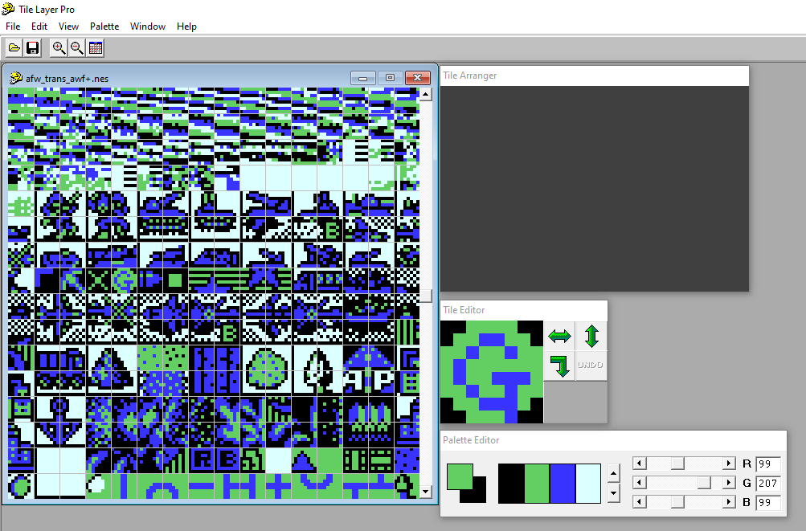
  <br>I used Tile Layer Pro to edit the tile data. The main window shows the raw data from the rom file (the junk at the top is code). The lower part with the images (tiles) are where the Pattern Table starts.
</p>

- The Name Table is a 256x240 block of data, which represents a single *frame*
  - Each byte in that 256x240 block of data has a tile ID
  - The Nametable is further sub-divided into 4x4 byte blocks, which contain attributes about the stuff located within them (e.g. color palettes)
- The tiles in the Name Table are *Background Tiles*
  - Background Tiles do not move, and are rendered fairly quickly
- Sprites, are made up of tiles *which move*

(This is more or less all you need to know for this exercise.)

So looking at the state of the world, Fighter B is represented as a 2x3 tile image, and there are two different kinds (one for Orange Star, one for Blue Moon). What I want is a battle copter in its place. Generally speaking this means I need to replace the existing Fighter B tiles with new beautiful art of a Battle Copter. Orange Star and Blue Moon also have two different helicopters, comprised of 2x4 tile images. So naturally, I just copied one of the existing helicopters (the one that looked more "agressive") and made that the defacto battle copter, then I copied the other helicopter (now known as the Transport Copter) over the other's "helicopter". This breaks the immersion, as now both armies use the exact same looking unit; but I'm not an artist ¯\\\_(ツ)_/¯

<p align="center">
  
  </br><i>(Left) Original unmodified ROM data, (right) Fighter B data is replaced with a B Copter, and Orange Star's B Copter design is made the same as Blue Moon's. </i>
</p>

So that's approximately 75% of the work done - indeed if you play the game now, and buy a b copter and engage in a fight, you would see... 75% of a battle copter. This is because the game represented the Fighter B unit as a 2 tall by 3 long tile cluster. So, now we go digging.

Something to point out is, to my surprise, the tiles which make up the units in the battle scenes are *not* sprites, but actually background tiles. After quite a bit of slow-mo debugging, I found that they were shown in the Pattern Table (only briefly, after they get rendered the table switches to a different one, which has the tile data for the "commander cheerleaders"). Anyway from there, I was able to deduce the IDs of those tiles - for example, Orange Star's Fighter B's top left tile has id `$48` (followed by `$49`, `$4A`). The tile was stored in the PPU at address $002102 (this is the data for the frame that will be drawn, i.e. the nametable). By adding a jaunty breakpoint when that value changes, I found that it's being assigned that value at 01C437:

*(from my notes, verbatim)*

```
STA 07 20 ; (STA PPU_DATA = #48, apparently)

(Note this is located in ROM, as opposed to CPU or PPU)

The line before it loads that tile (indirectly) from $0784!
Well... well... well... what else is there?

Bingo:
$0783: 03
$0784: 48 (!)
$0785: 49 (!) 
$0786: 4A (!) 
$0787: 20

```

`$0783`, with its value of `#03` was actually being used to specify "the number of tiles in the row" - indeed `$48`, `$49`, and `$4A` all represent the top half of Fighter B. After some more digging, I found that that value was originally `#23`, located at `$0700`. After way too many minutes, it dawned on me that `#23` was the height and width of the unit sprite representation (2x3 tiles). Indeed, the values starting at `$0700` were `23 48 49 4A 58 59 5A`, which are the tile IDs of the Fighter B unit; 2x3, the top 3, then the bottom 3. This would need to be changed to be 2x4, and point to the additional tile values.

Doing more debugging and tracing, I found what was going on. At `0149C0` the Unit Id was being loaded (in this case, the Fighter B's unit id is `#18`). An Arithmetic Shift Left was performed on it making it `#30`, and then the value was pushed into the Y register. Then, in basic terms, it looks up the *address* of where that sprite data is stored, *then* it looks at the content of the address to load the data (e.g. `23 48 49 ...`). In technical terms, it loads `$938A + Y` and `$938B + Y`, which produces values `#90` and `#94`, respectively. Those values combine to `$9490`, which is where the Fighter B sprite data is stored.

To fix this, I just needed to write the new sprite data for the B Copter; I chose a block of free data at 017000 for Orange Star, and 017010 for Blue Moon:

```
Orange Star:
OS: 24 48 49 4A C2 58 59 5A D2
BM: 24 0D 0E 0F C3 1D 1E 1F D3
```

Then, I updated the addresses that the `$938A/$938B` were resolving (note: I didn't mention, that Blue Moon's Fighter B has a different ID (`#19`), but the change is effectively the same). For Orange Star, it now pointed to `$AFF0`, which resolved `24 48 49 4A C2 ...`, thus rendering the entire battle copter sprite.

And after rendering 100% of the battle copter sprite... we're now 50% of the way there...

<p align="center">
  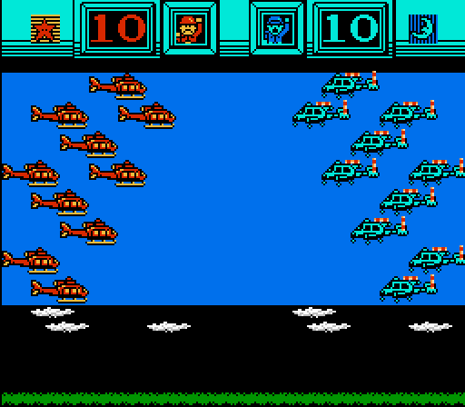
  </br><i>Can you spot it?</i>
</p>

Something which is unique to the helicopter unit compared to the other units of Famicom Wars is that it has two moving parts: the rotors. All other units are static background images, including the unit formally known as Fighter B. It took me a lot of debugging until I eventually found the code I was looking for, but you'll notice in the image above there are 10 units roughly in a line on each side of the battle field - well it just so happens that after rendering the battle field, we get this suspicious looking chunk of data in the CPU's RAM starting at `$1400`:

<p align="center">
  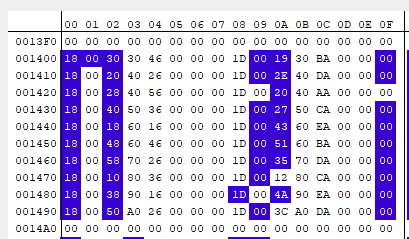
</p>

After looking at this for a bit, some values become apparent: in the 00 column, we have the unit IDs of the Orange Star troops, in this case `$18` (OS Fighter B, now B copter). In column `$08`, we have the IDs of Blue Moon's T Copters (`$1D`). We also have some data inbetween: `$03`/`$04` (and `$0B`/`$0C` for BM) are the X/Y values for... the helicopter rotor sprites. This is funny, as we loaded a unit other than the helicopter, but right there we have the x/y coordinates of where the rotor sprites *would* be. In fact, if you change the ID in column `$00` to be the helicopter Id `$1C`, the rotor sprites pop up.

<p align="center">
  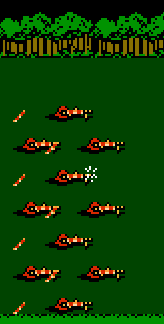
  </br><i>Fun fact: all units can have rotors</i>
</p>

So clearly, to enable rotors, I just need to "turn on" rotors for that Unit ID. Or restated, when the value of that particular address (e.g. `$400` for the first Orange Star unit) is the helicopter ID, it renders the rotor sprites.  So, I can set a breakpoint when `$400` is read - cause the CPU needs to read that value in order to determine if it draws the sprites or not.

Long story short, when the break point gets triggered, I look around and find that the ID is read, and "normalized" to an OS id. Once normalized, that ID is given to the Y register, and then we do an indirect lookup at `$830E + Y` and `$830F + Y`, and we get two values. For *every unit except the helicopter*, these values are `$CE` and `$C6` (which if put together hi-lo make the address `$C6CE`). Then, the CPU jumps to this address and etc. etc. However when the unit *is* a helicopter, the values are `$08` and `$84` (`$0884`) - and jumping to this logic renders the sprites.

So the fix is pretty simple. Thanks to normalizing the data for each unit, I just need to update the Fighter B unit's value. This is located just 4 address before the helicopter's (at `$8327` and `$8328`) to `$08` and `$84`. And, after that simple change...

<p align="center">
  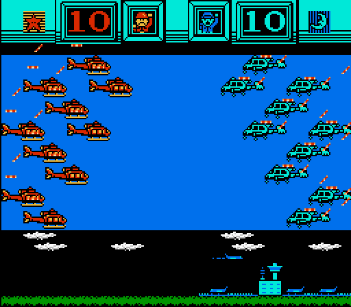
  </br><i>God damn it.</i>
</p>

Yet again, there's more work to be done - now, the offset of the rotor sprites is wrong. Looking at the offsets, it appears that the dimensions of the sprite come into play. The Y value ($4X3) is 1 tile length (-8 pixels) too far down, and the X value is 2 tile lengths too far to the left. To save time and energy, here are my notes verbatim from a code-walk I did, starting at loading the Unit ID at 01455A:

```
STA $0400,Y	; Y = 0, A = 18 (BCopter Id)
LDX $0A		  ; Load $0A (#00) into X
JSR $8824	  ; Some SR
	-- SR --
TAY			    ; put unit Id into Y (#18)
LDA $00		  ; A becomes #01 (maybe stands for the 1st unit in the battle group?)
PHA 		    ; Push Acc (#01) to stack
LDA $01		  ; Loads #07 into A (no idea)
PHA			    ; pushes Acc (#07) to stack
TYA			    ; Acc gets unit id again (#18)
AND #FE		  ; normalize it (OS -> OS, BM -> OS unit id)
TAY		  	  ; put it back in Y (#18)
LDA $96B2,Y	; -> $96CA => #38
			      ; This is probably what needs to be changed; another lookup table
STA $38		  ; Store it in $38 (value #38)			
LDA $9590,Y ; -> $95A8 => (#EE)
STA $00		  ; put it in $00 (#EE)
LDA $96B3,Y	; -> $96CB (#38)
			      ; complementary to the previous value loaded
STA $39		  ; Store it in $39 (value #38)
LDA $9591,Y	; -> $95A9 (#95)
STA $01		  ; Stored in $01
TXA			    ; Transfer X to A (#00)
AND #0F		  ; Does an AND against it (still #00)
ASL			    ; (#00) 
TAY			    ; Y becomes #00
LDA $00		  ; loads $95EE, which is also #00
			      ; >> this, leads to probably yet another lookup table, but perhaps 
			      ; exactly what I need to change. This did a lookup for BCopter, should probably be the same as TCopter ($95F2, $95F3, values #10 #10) <<
ADC $38		  ; Adds $38 to A
STA $38		  ; Store result back in $38
INY			    ; inc Y to #01, go to next address
LDA $00,Y	  ; -> $95EF, #00
CLC			    ;
ADC $39		  ; 
STA $39		  ; Again, add value and store it back in $39 (value #38)
PLA			    ; 
STA $01		  ;
PLA 		    ;
STA $00		  ; 01 07 are back in $00, $01 again
			      ; This SR looked up something from deep in memory, and assigned those values(plus some offset) to $38,$39
	-- end SR --			
LDX $04		  ; Load $04 (#09) into X
LDY	$8643,X	; -> $864C (#00) into Y
INY
INY
INY			    ; Increment Y to #03 (lines up with 4X3, the Y value for the sprite)
LDA $38		  ; Loads the value at $38
STA $0400,Y	; Puts it in the Y sprite offset value (!!)
INY 		    ;
LDA $39		  ;
STA $0400,Y	; Stores it in the X sprite offset value (!!)

There were 2 areas of interest, which were based off the unit id:
$9590, $9591 (actual: $95A8, $95A9) : value of EE/95 for Bcopter, EE/95 TCopter
$96B2, $96B3 (actual: $96CA, $96CB) : value of 38/38 for Bcopter, 30/46 TCopter
```

(This is, by the way, how I do most of my changes: I debug until I get to a point where I need to understand what's going on, then I walk through the code, annotating it, until I can "tell a story" that makes sense. For my Famicom Wars patches, I wrote over 1000 lines (10,206 words) of notes - the vast majority of which don't get included with these write-ups. If you intend to learn or make your own patches, don't be afraid to dig in like this.)

Anyways - in the middle of this codewalk, it does yet another lookup by type id, and those values lead to the data that I'm interested in (the Y/X offsets for the rotor sprites.) Since the B Copter sprite is literally just a copy of one of the helicopter sprites, I can simply have it point to the same location in memory that's servicing the TCopter sprites. Thus,  `0156DA/0156DB` were changed to `$30` `$46`, and...

<p align="center">
  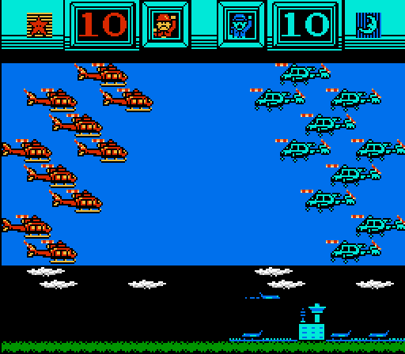
  </br><i>We got it.</i>
</p>

There were a few miscellaneous things that still needed to be updated; the "map" sprite tiles for Fighter B needed to become a B Copter - this was easily done by copyin' and pastin' the existing Helicopter tiles, but slapping a "B" in the bottom right corner (which, was my only art contribution). After going through and updating all the other tiles I could find with the appropriate new tiles - Famicom Wars officially had a Battle Copter.

Bonus note: I decided against redesigning the TCopter for two reasons: one, I'm not an artist - and two, it would require some extra special hacking to get double the rotor sprites for that "Chinook" style helicopter. If someone wants to add that, go for it.

### Bonus: English Translation Patch

So, unfortunately, the english patch bumps into some of these changes and overwrites the data. I assume that this is because the english names of the units require extra data (or whatever), and that required changing the unit "objects". So effectively, applying the english patch overwrites the cost and movement changes. Thus, I created the 2nd post-install patch which fixes the data after the english patch is applied. Really it's just doing the same stuff I outlined above (changing unit properties), except a few values are in different locations. Most notably, the battleship and transport objects were moved to a different location, so I had to do a little hunting, but that was alright. 

## Conclusion
Thanks if you read this all the way through; this one felt a bit more boring and long-winded than my other write-ups. 

<p align="center">
  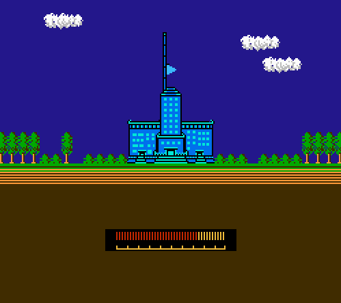
</p>

In terms of the development work on this: doing First Strike first really got me interested in the mechanics of the game, and also made me realize that, frankly, it wasn't enough. But after studying the "code" for so long, I felt ready to really make a change to the "formula". This was largely a technical exercise; I didn't need to come up with any "game design", I simply had to apply what was already done with Advance Wars, down to the detail of unit price and damage. This also marks my first patch which makes a graphical change - even though it was just copy and paste.

As for the results, I'll say this:

I played it, and I had fun. I hope you do to!