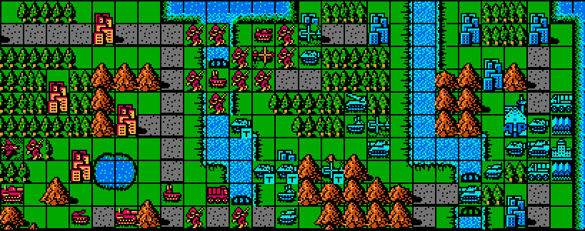
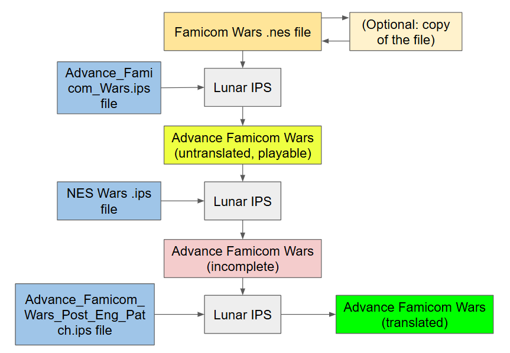
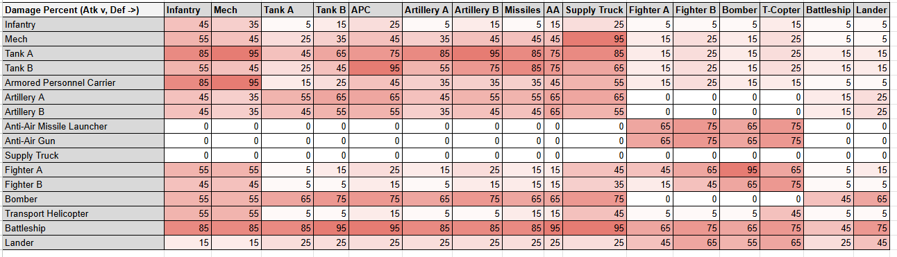
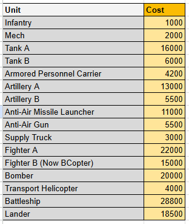
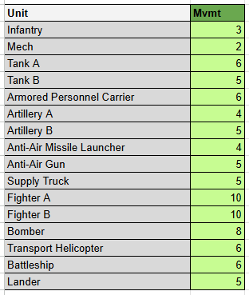
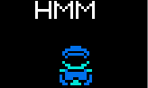
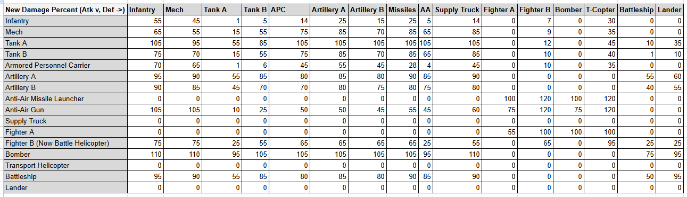
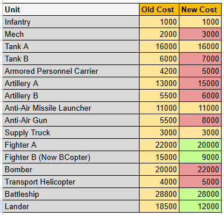
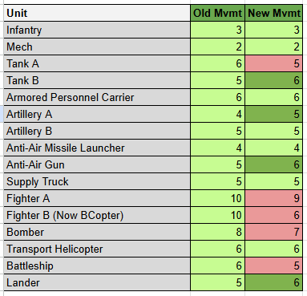

# Advance Famicom Wars

  

This repo contains a patch which overhauls Famicom Wars by applying several features from its predecessor, Advance Wars. This includes:
- Adding [first strike](https://github.com/schil227/FamicomWarsFirstStrike)
- Changing the damage which units deal
- Adjusting costs
- Tweaking movement
- Swapping the "Fighter B" unit for a Battle Copter

In short: it's Famicom Wars, but actually fun.

Note that this patch supports the (currently) newest english translation, however it requires an extra patch step. 

## **Installation**  

To install the patch, follow these steps:
* Have a copy of the Famicom Wars .NES file (*These steps will override the existing file, so make sure to copy the original if you wish to have a vanilla version of the ROM*)
* Download the patch `Advance_Famicom_Wars.ips` from this repository
* Download [Lunar IPS](https://www.romhacking.net/utilities/240/), a program which can be used to apply the patch
* Run Lunar IPS
    * Select "Apply IPS Patch"
    * Locate the Advance_Famicom_Wars.ips file
    * Next, Locate the vanilla Famicom Wars .NES file (again, I suggest making a copy beforehand)

At this point the rom can be played - but if you would prefer to play with an english translation, there are some additional steps:

* Download the Famicom Wars English patch (released by Stardust Crusaders) [here](https://www.romhacking.net/translations/6828/), extract the compressed directory
* Using Lunar IPS, follow the above steps, but instead apply the translation IPS patch `NES Wars.ips` *to the previously patched .NES file*
* Next, download the other patch from this repository `Advance_Famicom_Wars_Post_Eng_Patch.ips`
* Again, use Lunar IPS to patch the "Post Eng Patch" to *the same .NES file*

Then, you're done. Here's an image to help illustrate the steps:

  

## Why This Patch Was Created
Shortly after rolling out the First Strike patch, I (tried) to play a bit of Famicom Wars - but the gameplay is still not right. The more you look at it, the more you see just how wildly unbalanced everything is. For example, I extracted the damage which all the units do to one another into a table:

### The Damage

  
   <i>Here it is. Note: the heat-map is just for "bigger numbers", nothing special.</i>

There are some things one could extract from this, but one of the biggest is that, pound-for-pound the infantry is far and away the best unit. For one, they can attack everything, from battleships to bombers. In vanilla Famicom Wars, a bomber (worth 20000G) can attack an infantry (1000G), and do a *pathetic* 55% damage (that's 550G). Meanwhile, since there's no first-strike, the infantry attacks the bomber, and does %5 damage... which is 1000G.

  
   
   The rifle is valued at £3,700,000 (<a href="https://metro.co.uk/2022/09/06/ukrainian-pensioner-awarded-medal-after-shooting-down-russian-aircraft-17306308/">link</a>)

Also, notice that an infantry does 45% damage to other infantry - this means that you would need 3 infantry to destroy one. And in the vanilla version of the game, those attackers would be in rough shape after destroying the one defender. In fact, 45% is the rule for any unit which attacks itself (again, 3 to 1 destruction ratio). But also take note: no one unit outright destroys another. We have a handful of units which do 95% damage, but nothing which KOs a unit in one hit. This is lame. Finally, the utility of all the units is quite lopsided. Some units (infantry, fighters, battleships, etc.) can strike everything, and are inherently more valuable. Why does Tank B do the same (more?!?) damage than Tank A? Why does an anti-air only shoot wet spaghetti noodles at airplanes? Why are battleships unsinkable? Why, why, why.

Some of these things are almost justified by the money.

### The Cost

I have another chart for you:

  
   <i>Here it is.</i>

There are some dubious values here, to be sure: unsinkable Battleships cost 28800G, unsinkable Mechs are 2000G, Landers are an eye-watering 18500G. But what is the true value of these units? A Battleship is crazy expensive, but it is a virtually unsinkable juggernaut, so that kinda makes sense. But the lander, a unit whose main purpose is to shuttle land units, gets a crappy machine gun strapped to it's deck. Added functionality costs something, but it's main purpose is to be a "cheap" way to deal with battleships.

But, wholistically, the Wars series (or, perhaps "wars" in general) are strongly tied to economics. In a game setting, these economics need to balance out. Take this example:

In Advance Wars, the bomber is a top-tier unit; it can move quickly and it annihilates ground units, so it's going to cost a lot (22000G) - however it is quite flimsy, and can be destroyed by certain units rather quickly, especially the fighter and anti-air. So naturally, you want to protect your bomber, and depending on how much the opponent spends (either a significant sum for a fighter (20000G), or they go for the economical AA (8000G)) the effects will be proportional. An AA keeps a zone of control on the land, while a fighter, with its whopping 9 movement, can out-zone your bomber for most of the map. With your bomber, you need to move carefully; if it's an AA, you can try to punch through with your other units to damage the AA, or get the first strike and blow it up yourself. If the threat is a fighter, you need to strike in tandem with other units to protect you bomber with mutually assured destruction (e.g. a missile unit covering your bomber, an AA waiting in the wings, etc.). And of course, you would only make a calculated risk to, say, attack a rocket which has your medium tank pinned down - but you wouldn't if it meant a net-loss of sacrificing your bomber. 

That is all to show, the cost of the units themselves have an integral part of the strategy of Advance Wars. Further, units have natural counters; medium tanks against the indirects, rockets against anything this side of the mountain range, battleships against subs, etc. These natural counters come at a cost, either monetary or in function. 

But, in Famicom Wars, it would take 7 shots from an Artillery (A or B) to sink a battleship. It would take 4 attacks from a Lander. *It would take 3 bomber strikes*. The economics just don't add up. And granted, this is more of an issue with the battleship not having a natural counter, such as a submarine, however the units to dislodge it cost big, big money and do a terrible job at it. This can also be applied to infantry, but on the inverse: they cost nearly nothing, and the things which are good at destroying them are expensive, and thus loose the attack trade. 

So does the cost justify the value? Not really.

Economics are one thing, but what about mobilization?

### The Movement

I have at least one more chart for you:

  
   <i>Here it is.</i>

The trend for this is largely that the more expensive units tend to have better movement. Tank A has 6, while Tank B has 5. Battleships move 6, and Landers move 5. This concept was inverted with Advance Wars, where the usually inexpensive units had generally better movement, so you had to be more strategic with your units.

Take the NeoTank (22000G): what makes it such a big threat? Unlike a bomber it is heavily armored, and does not suffer from getting countered by cheap direct units (e.g. an anti-air). However at the same time, it is stuck on the ground, suffering the terrain costs. It hits harder than the medium tank, and is designed to be a counter to them; but just as well you could use another medium tank and spend the extra 6000G on an artillery. Indeed: the real value that the NeoTank brings is its +1 movement. Coupled with the "tread" movement type, it has the best maneuverability possible for a land-based unit (only outpaced by the wily recon on ideal terrain). Restated, the NeoTank fixes the main vulnerability of the medium tank: it's movement.

This tangent is largely to point out that movement is integral to the value of a unit, and how it can be used to balance out the gameplay. If cheaper, weaker units are also easier to hit because they cannot move very far, then their viability drops off as the more expensive units are outright better. Advance Wars grew into that balance, but it took a few iterations for Famicom Wars.

But otherwise, generally the movement values are a little off. Speaking of a little off...

### The "Triangle"

Now, compared to Advance Wars, Famicom Wars is just a different game. It plays different, the strategy is different, the "meta" is different. But between the damage output, the cost, and the movement, there's a noticeable lack of synergy in the gameplay. No first strike means movement matters a lot less, or rather, it only serves to *avoid* combat. Direct units are inherently less valuable than indirects, as they always lose a hp whenever you use them. The general concept of "strategy" in Famicom Wars boils down to using indirects and infantry walls, and the game devolves into a slog.

By contrast, the units of Advance Wars are very efficient at what they do. Infantry still play a critical role, however they are made much more fragile and much less effective: they capture, counter other infantry/mechs, and protect your army (and notably, they do not shoot down bombers). Tanks probably compose the next biggest chunk of your army, which are economically valuable units to destroy indirects, and protect your "squishy" units. The natural counter to Tanks are battle copters, which are able to strike with superior maneuverability, but are torn to shreds by the anti-air. Anti-air are excellent at removing infantry walls, and better at KO-ing expensive air units, but are weak to the tank. What I just described is known as the Triangle; tank beats AA, AA beats BCopter, and BCopter beats tank. But that's a simplification - you also have the threat of indirects, the power of "tech-ing up" to medium tanks, etc. - the point is, there is a lot of nuance to the strategy of Advance Wars.

This is, of course, not to put down Famicom Wars. Without Famicom Wars there is no Advance Wars, and Advance Wars had the massive benefit of learning what does and doesn't work from the previous installments. But it does beg the question: knowing what we know now, how could we change Famicom Wars to adopt the advances of Advance Wars?

## The Changes
The goal of this patch was to balance things out. The easiest way to do this is to apply the Advance Wars formula bit-for-bit to Famicom wars, but that's not quite possible. See, there are a few differences (many technical) that would need to be resolved, but in doing so it would dilute the game. We already have Advance Wars, we don't need a carbon clone, we need Famicom Wars to be fun. 

That said, before getting into the changes, we should go over what wasn't changed.

### What Wasn't Changed

  

- Mech units require 2 movement to cross mountains (as opposed to 1)
  - This is due to them sharing a movement type with infantry. Later games have a separate "mech" movement type giving them 1 movement on everything, here it was left as is.
- Units are not automatically supplied
  - Famicom Wars requires an extra step of calling the "supply" command before units get healing/fuel/ammo. It doesn't effect units which were already used, so the only real benefit is for picking units which you explicitly *don't* want to supply, and for punishing forgetful players.
- APC/Landers: loading units ends the transport's turn
- Battleships have a smaller range (3-5 spaces)
- (Spoilers) the new Battle Copter unit is still referred to as Fighter A
- Supply units cannot resupply air units
- The CPU Player
  - As in, they're the same bone-headed ding-dongs they were before. I offer no guarantee on their quality post-changes, but I played a match and seemed as competent as before

As for the reason *why* these things weren't changed, it ranges from indifference, to (I'm) technically incapable, to "It's just fine the way it is" (cope).

### Updated Damage

  

This table is largely lifted from Advance Wars; units do what you expect them to. Medium tanks hit like a truck, bombers hit like a medium tank, and anti air was upgraded from "noodle shooter" to "war criminal". The ill-fitting Fighter B unit was changed to a battle copter, and mirrors its damage. Transports can no longer attack, but battleships are significantly more susceptible to air units.

Everything fits into place, except for the APC. In Famicom Wars, the APC is a weird mix of the Advance Wars APC (can transport troops) and recon (can shoot) units. It uses the "tread" movement type and can move 6 spaces, and it notably cannot supply units. So the question becomes: what the hell do we do with this? After some thought, I decided that the damage that it does should match that of the recon, while the damage that units do to it should be like the Advance Wars APC (meaning, in Advance Wars, units tend to do more damage to Recons than the more well-armored APCs). With this little artistic touch, we keep the Famicom Wars "weirdness" with a neat little unit.

### Updated Cost

  

Of course, in order for the economics to make sense, costs need to be updated. In general, the low-tier units have become more expensive to match their increase in firepower, the greatest jump happening to the anti-air unit (5500G -> 8000G). For the APC, I considered the swap of "supplying" with "having a machine gun" enough to warrant the 5000G price, while the Supply unit sticks with a reasonable 3000G. 

### Updated Movement

  

Generally speaking, the low-tier units get a boost, while the high-tier units get nerfed. Coupled with the first-strike change, these slight changes have a large impact.

### Establishing the "Triangle"

As mentioned, the Fighter B unit was swapped out for a Battle Copter.
